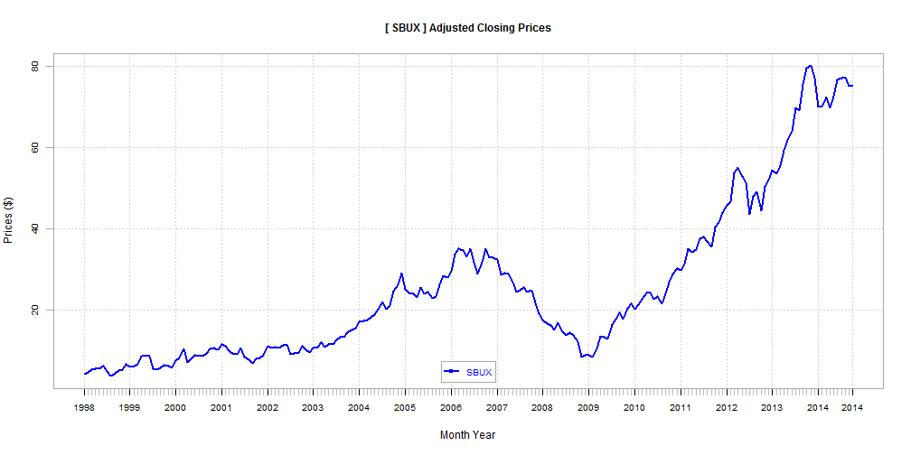
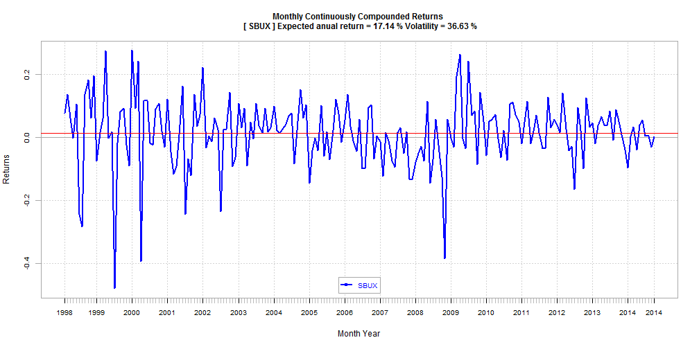

## Stock Viewer application summary

This application will get the monthly stock prices of the company specified with its SYMBOL, and create a time series chart of prices or returns depending on the check box. Information will be collected from Yahoo! online in the period from 1998-01-01 to 2014-10-31. When the check box is Off (initial), the monthly adjusted closing prices will be displayed. If On, the monthly continuously compounded returns will be displayed along with the expected annual return and volatility in %.

The next three slides show 

     1. Menu layout
     2. Stock Price Chart Example (SBUX) 
     3. Stock Return Chart Example (SBUX)

The real interactive application can be accessed at the following link. 

  Try it!   [Stock Viewer](https://atibot.shinyapps.io/project/)

---

## 1. Menu layout
The left side menu looks below. The chart will be shown in the right space.

  

    <form class="well">
      <h4>According to the checkbox(On/Off), 
         create and display a monthly stock price chart or
         a monthly return chart of the company specified with its SYMBOL.
         Information will be collected from Yahoo! in the period from 
         1998-01-01 to 2014-10-31</h4>
      <label for="symbol">Enter SYMBOL</label>
      <input id="symbol" type="text" value="SBUX"/>
      

      <button id="goButton" type="button" class="btn action-button">Go!</button>
      <h5>Click the button to update the chart of the sybmol you enter.</h5>
      

      <label class="checkbox" for="checkbox">
        <input id="checkbox" type="checkbox"/>
        Price chart (Off) or Return chart (On)
      </label>
      <h5>If checked (On), a chart of monthly continuously compounded returns is displayed 
         along with the expected annual return and volatility in %.
         The red horizaontal line shows the mean of monthly returns.</h5>
    </form>
  

  

    

  

---

## 2. Stock Price Chart Example (SBUX) 

The adjusted closing prices are plotted as below.

 

---

## 3. Stock Return Chart Example (SBUX)

The continuously compounded returns are plotted as below.

 
